<p align="center">  </p>
<h1 align="center">🤖 OpenCode Commands 🤖</h1>
<h2 align="center">A Repository by ElMarcels</h2>

---


---

## 📖 Table of Contents

- [What is this?](#-what-is-this)
- [Quick Start](#-quick-start)
- [Installation](#-installation)
- [Usage](#-usage)
- [Command Categories](#-command-categories)
- [Repository Structure](#-repository-structure)
- [Anatomy of a Command](#-anatomy-of-a-command)
- [Contributing](#-contributing)
- [License](#-license)

---

## 💡 What is this?

[opencode](https://opencode.ai) lets you define **custom commands**: Markdown files containing a prompt (plus optional configuration) that you trigger from the TUI by typing `/command-name`.

This repo is a curated library of those commands, organized by category, so you can:

- ⚡ **Save time** with battle-tested prompts for everyday tasks
- 🧩 **Mix and match** — install only the categories you need
- 🛠️ **Customize** — every command is a plain Markdown file you can edit
- 🤝 **Share** — contribute your own and help others

---

## 🚀 Quick Start

```bash
# 1. Clone the repository
git clone https://github.com/<your-username>/opencode-commands.git
cd opencode-commands

# 2. Copy the commands you want into your global opencode config
mkdir -p ~/.config/opencode/command
cp commands/git/*.md ~/.config/opencode/command/

# 3. Open opencode and run a command
opencode
# then type: /commit
```

---

## 📦 Installation

You can install commands **globally** (available in every project) or **per project**.

### Option A — Global install (all projects)

```bash
mkdir -p ~/.config/opencode/command
cp -r commands/**/*.md ~/.config/opencode/command/
```

### Option B — Project install (current project only)

```bash
mkdir -p .opencode/command
cp /path/to/opencode-commands/commands/testing/*.md .opencode/command/
```

### Option C — Symlink (stay up to date with `git pull`)

```bash
ln -s "$(pwd)/commands/git" ~/.config/opencode/command/git
```

> **Note:** Depending on your opencode version, the folder may be named `command/` or `commands/`. Check the [official docs](https://opencode.ai/docs/commands/) if your commands don't show up.

### Install a single command

```bash
curl -o ~/.config/opencode/command/review.md \
  https://raw.githubusercontent.com/<your-username>/opencode-commands/main/commands/code-review/review.md
```

---

## ▶️ Usage

Inside opencode, type `/` to see the list of available commands, then pick one:

```text
/review
/test src/utils/parser.ts
/explain @src/index.ts
/commit
```

Many commands accept arguments:

| Syntax        | Meaning                                         |
| ------------- | ----------------------------------------------- |
| `$ARGUMENTS`  | Everything you type after the command name      |
| `$1`, `$2`, … | Individual positional arguments                 |
| `@path/file`  | Include a file's contents in the prompt         |
| `` !`cmd` ``  | Inject the output of a shell command            |

**Example:**

```text
/fix-issue 142
```

---

## 🗂️ Command Categories

> Replace or extend this table as your collection grows.

| Category            | Folder                    | Examples                                         |
| ------------------- | ------------------------- | ------------------------------------------------ |
| 🔀 Git & GitHub     | `commands/git/`           | `/commit`, `/pr`, `/changelog`, `/fix-issue`     |
| 🔍 Code Review      | `commands/code-review/`   | `/review`, `/security-audit`, `/perf-check`      |
| 🧪 Testing          | `commands/testing/`       | `/test`, `/coverage`, `/e2e`, `/mock`            |
| ♻️ Refactoring      | `commands/refactor/`      | `/simplify`, `/extract`, `/rename`, `/dedupe`    |
| 📝 Documentation    | `commands/docs/`          | `/readme`, `/docstrings`, `/explain`, `/api-doc` |
| 🐛 Debugging        | `commands/debug/`         | `/debug`, `/trace`, `/root-cause`                |
| 🏗️ Architecture     | `commands/architecture/`  | `/design`, `/adr`, `/diagram`                    |
| 🚢 DevOps           | `commands/devops/`        | `/dockerize`, `/ci`, `/k8s`, `/terraform`        |
| 🗄️ Databases        | `commands/database/`      | `/schema`, `/migration`, `/optimize-query`       |
| 🌐 Frontend         | `commands/frontend/`      | `/component`, `/a11y`, `/responsive`             |
| ⚙️ Backend / APIs   | `commands/backend/`       | `/endpoint`, `/openapi`, `/validate`             |
| 🔐 Security         | `commands/security/`      | `/threat-model`, `/deps-audit`, `/secrets-scan`  |
| 🧹 Maintenance      | `commands/maintenance/`   | `/upgrade-deps`, `/lint-fix`, `/dead-code`       |
| 🎓 Learning         | `commands/learning/`      | `/eli5`, `/walkthrough`, `/quiz-me`              |

---

## 🧱 Repository Structure

```text
opencode-commands/
├── commands/
│   ├── git/
│   │   ├── commit.md
│   │   └── pr.md
│   ├── code-review/
│   │   └── review.md
│   ├── testing/
│   │   └── test.md
│   └── ...
├── templates/
│   └── command-template.md
├── scripts/
│   └── install.sh
├── CONTRIBUTING.md
├── LICENSE
└── README.md
```

---

## 🔬 Anatomy of a Command

A command is just a Markdown file. The filename becomes the command name (`review.md` → `/review`).

```markdown
---
description: Review the current changes for bugs and style issues
agent: plan
model: anthropic/claude-sonnet-4-5
subtask: false
---

You are a senior engineer performing a code review.

Here are the current changes:

!`git diff`

Focus on:
1. Correctness and edge cases
2. Readability and naming
3. Performance pitfalls
4. Missing tests

Additional focus from the user: $ARGUMENTS
```

**Frontmatter options**

| Field         | Description                                                   |
| ------------- | ------------------------------------------------------------- |
| `description` | Short text shown in the command picker                        |
| `agent`       | Which agent runs the command (e.g. `plan`, `build`)           |
| `model`       | Override the default model for this command                   |
| `subtask`     | Run the command as a subtask without polluting main context   |

You can also define commands directly in your `opencode.json` under the `command` key. See the [official documentation](https://opencode.ai/docs/commands/) for details.

---

## ❓ FAQ

**My commands don't appear in opencode.**
Check the folder name (`command/` vs `commands/`), make sure files end in `.md`, and restart opencode.

**Can I override a command from this repo?**
Yes. Project-level commands (`.opencode/command/`) take precedence over global ones.

**Can I use these with a different model?**
Absolutely. Remove or change the `model:` line in the frontmatter and opencode will use your default.

---

## 📄 License

Distributed under the [MIT License](LICENSE). See `LICENSE` for more information.

---

## ⭐ Support

If this repo saves you time, consider giving it a **star** ⭐ and sharing it with other opencode users.

> *This project is community-driven and not officially affiliated with opencode or SST.*
